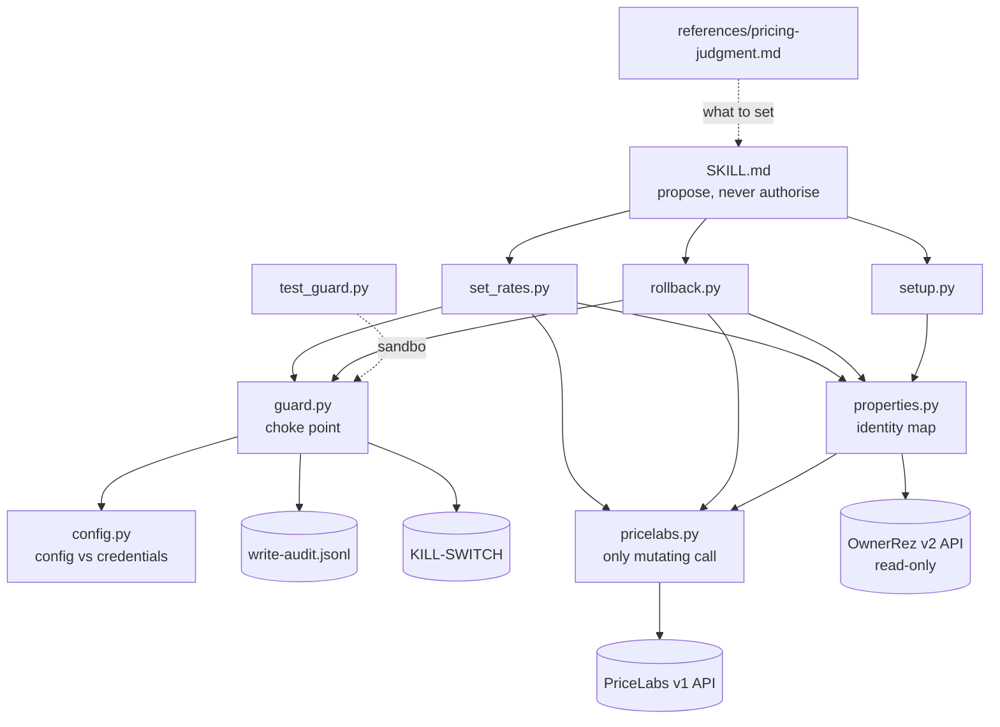

# System architecture

## Overview

A Claude Code skill (`ownerrez-rate-setter/`) that ships its own Python tooling. `SKILL.md` tells Claude how to operate; the scripts enforce the safety properties so they do not depend on Claude following instructions.

| Module | Responsibility |
|---|---|
| `SKILL.md` | The one rule (propose, never authorise), non-negotiables, order of operations, how to read each guard verdict |
| `references/pricing-judgment.md` | Judgment on *what* to set, kept apart from the mechanics of *how* |
| `scripts/config.py` | Local config (`.rate-setter/config.json`) and credentials (environment variables only), deliberately separate; fails closed |
| `scripts/guard.py` | The single choke point: kill switch, mode, permitted lever, sanity, caps, cooldown, approval, audit ([[fail-closed-write-guard]]) |
| `scripts/pricelabs.py` | PriceLabs client; the **only** module allowed to issue a mutating call; read-back verification ([[single-mutating-call-and-read-back]]) |
| `scripts/properties.py` | Identity: pairs OwnerRez properties to PriceLabs listings; refuses ambiguity ([[identity-through-property-map]]) |
| `scripts/set_rates.py` | CLI: dry run by default, `--execute` explicit |
| `scripts/rollback.py` | CLI: plan by default, restores from the audit log, still guarded ([[rollback-from-audit-log]]) |
| `scripts/setup.py` | `--init` (SHADOW config), `--check` (credential presence + connectivity), `--map`, `--status` |
| `scripts/test_guard.py` | 26 sandboxed failure-mode tests, mostly negative, no network |

Local state lives in `.rate-setter/` beside the user's project (found by walking up from the working directory): `config.json`, `property-map.json`, `write-audit.jsonl`, and a `KILL-SWITCH` file when engaged. It is git-ignored, as are `.env` files and logs.

## Module graph

## Constraints

- **Fail closed everywhere.** Missing or unreadable config, an unset mode, or any exception inside the guard is a denial.
- **One mutating call.** Only `pricelabs.push_price` issues a POST; every write path goes guard → push → record → read-back.
- **OwnerRez is read-only** for this tool; rates are written to PriceLabs, which then pushes to channels (the user presses Sync Now to speed that up).
- **Credentials never touch config or disk** in the repo; only presence is ever printed.
- **Guard parameters live in local config**, except the maximum-price prohibition, which is enforced in code.
