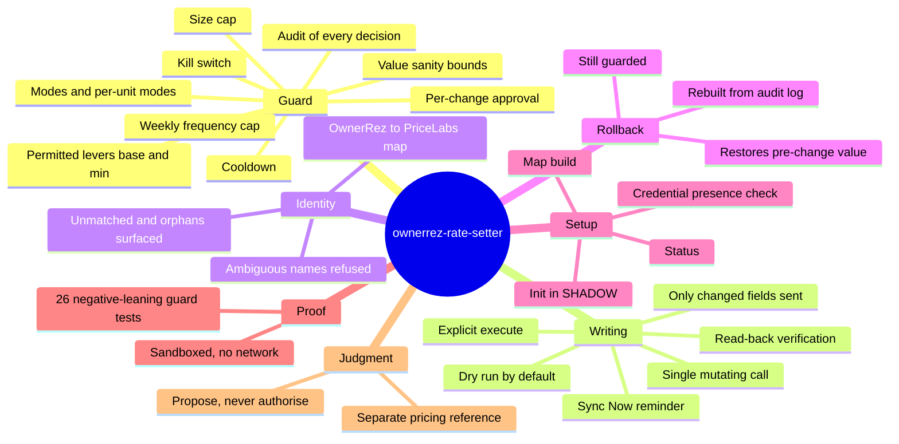

# Feature mindmap

## Feature mindmap

Pages behind the branches: [[fail-closed-write-guard]], [[shadow-by-default-and-write-modes]], [[approval-bound-to-one-change]], [[single-mutating-call-and-read-back]], [[identity-through-property-map]], [[rollback-from-audit-log]].
