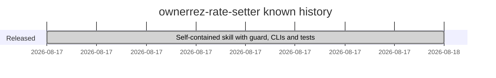

# Roadmap

## Milestones

The repository has one commit (2026-08-17), which published the self-contained skill: guard, PriceLabs client, identity map, setup, set/rollback CLIs, the guard test suite and the judgment reference. The commit message reports an end-to-end verification against a live portfolio before packaging, and that test artifacts containing credentials were removed first. No roadmap or changelog is recorded.

## Open questions for the owner

- **`FULL_AUTONOMY` semantics.** Docs say it writes without caps; the guard applies caps identically in every write mode. Which is intended? ([[shadow-by-default-and-write-modes]])
- **`--emergency` rollback scope.** Docs say it clears cooldown and frequency caps only; in code it also bypasses the size cap. Which is intended? ([[rollback-from-audit-log]])
- **Packaging.** Should the `.skill` zip be rebuilt with `/` separators? (see stack open items)
- Are further versions planned (for example, a changelog or version line)? Nothing in the repo says.
