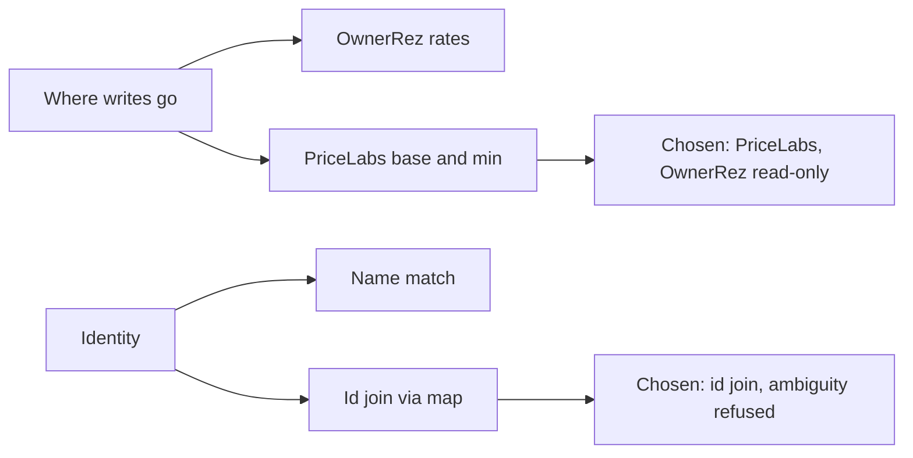

# Tech stack

## Technology choices

| domain | candidates | decision | rationale |
|---|---|---|---|
| Delivery | Procedure-only skill driving private scripts; self-contained skill | Self-contained Claude Code skill shipping its own scripts | The earlier procedure-only version was inert outside one private project (git log) |
| Language | Python | Python 3.9+ with `requests` as the only third-party dependency | Small CLIs, simple HTTP; nothing else needed |
| Pricing system written to | PriceLabs v1 API | `GET`/`POST /v1/listings` with an API-key header | PriceLabs holds base/min and pushes to channels |
| Property source | OwnerRez v2 API | Read-only, HTTP Basic auth, paginated by `next_page_url` | Needed only to build the identity map |
| Identity join | Name matching; id join | Exact id join (PriceLabs stores the OwnerRez property id as its listing id) | Name matching is how the wrong home gets repriced ([[identity-through-property-map]]) |
| Config | Env vars; JSON file | JSON in `.rate-setter/config.json` (no secrets) | Safe to read and edit by hand; mode changes are deliberate edits |
| Credentials | Config file; env vars | Environment variables only, with an optional account-name suffix for multi-account setups | Keeps secrets out of config and the repo; only presence is printed |
| Audit | Database; append-only file | Append-only JSONL (`write-audit.jsonl`) | Every allowed/denied/applied event, and the source for rollback |
| Emergency stop | Config flag; file presence | Presence of a `KILL-SWITCH` file | Works even when config is broken; one obvious thing to delete |
| Tests | pytest; plain script | Plain-Python sandboxed script, 26 cases (26/26 passing when this page was written) | No test dependency; never touches real config or the network |
| Packaging | Folder; `.skill` zip | Both | Copy the folder, or install the packaged file |
| License | — | MIT | `LICENSE`; the README adds a no-warranty caution |

## Decision mindmap

## Open items

- **Zip path separators.** Entries in `ownerrez-rate-setter.skill` are stored with backslash (`\`) separators; the ZIP convention is `/`. Some extractors on macOS/Linux may produce flat files with backslashes in their names (inferred risk; not tested here). Contents match the folder.
- **Mode semantics vs code.** See the open question on [[shadow-by-default-and-write-modes]].
- **Emergency rollback scope vs code.** See the open question on [[rollback-from-audit-log]].
